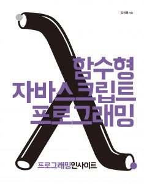

# Functional JavaScript

SICP 스터디의 연장선으로 격 주로 번갈아가며 아래 **Functional JavaScript [마이클 포커스] | 함수형 자바스크립트 프로그래밍 [유인동]** 두 책을 가지고 함수형 프로그래밍 스터디를 진행할 것 이다.

        

## 이 스터디에서 얻을 수 있는 것?

- 자바스크립트를 통한 함수형 프로그래밍에 대한 이해
- 객체지향 프로그래밍과 함수형 프로그래밍의 차이
- Underscore.js를 직접 만들며 함수형 자바스크립트 뼈대 익히기

스터디 목적과 방법은 차차 개선하는 것으로 하겠다.

## 표기법 규칙

Functional JavaScript [마이클 포커스] 의 표기법 규칙을 따른다.

- 변수에 값을 한 번 이상 할당하지 않는다.
- eval은 사용하지 않는다.
- Array 와 Function 같은 핵심 객체는 고치지 않는다.
- 객체를 먼저 생성하고 객체의 메서드를 생성하는 방법보다는 함수로 작성한다.
- 프로젝트 시작 단계에서 정의한 함수는 다음 단계에서도 그대로 작동해야 한다.

그 밖에도 이 책에서는 다음과 같은 규칙을 사용했다.

- 파라미터가 없는 함수는 인자가 중요하지 않다는 사실을 보여준다.
- 예제에서 ... 는 주변 코드가 중요하지 않음을 가리킨다.
- inst#method 같은 텍스트는 인스턴스 메서드의 레퍼런스임을 의미한다.
- Object.method 같은 텍스트는 형식 메서드의 레퍼런스임을 의미한다.
- 필자는 세미콜론을 즐겨 사용한다.

## 스터디 구성원

이 스터디는 실무 개발 역량 강화를 위한 컴퓨터 공학 CAMP 1기에서 시작되었습니다.

- 김해든
- 이슬기

# Summary

- [20180212 Start Functional JavaScript](./summary/20180212.md)

